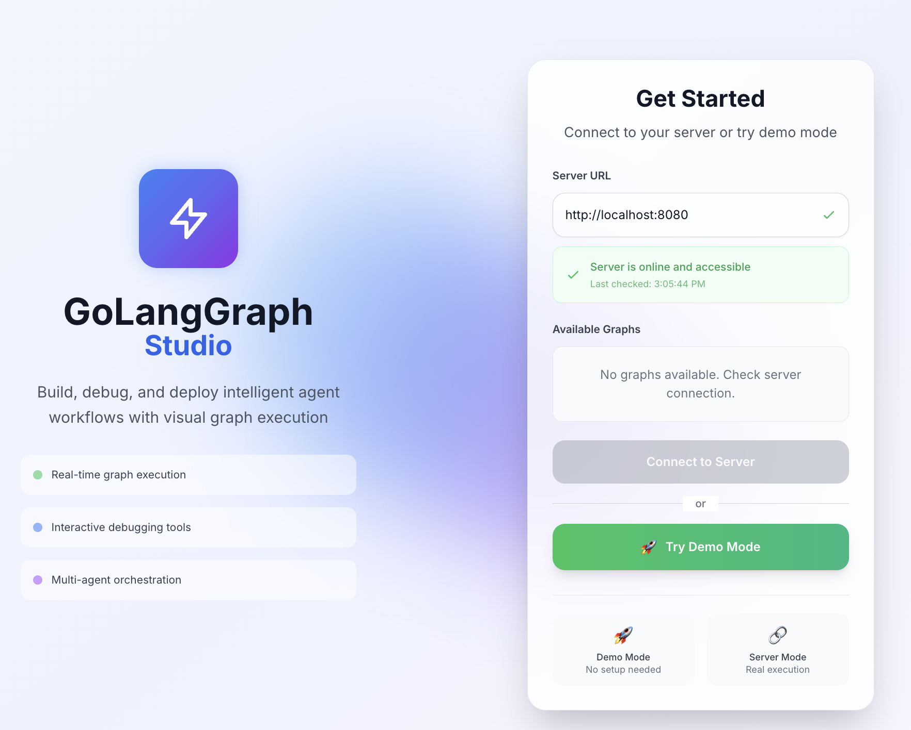
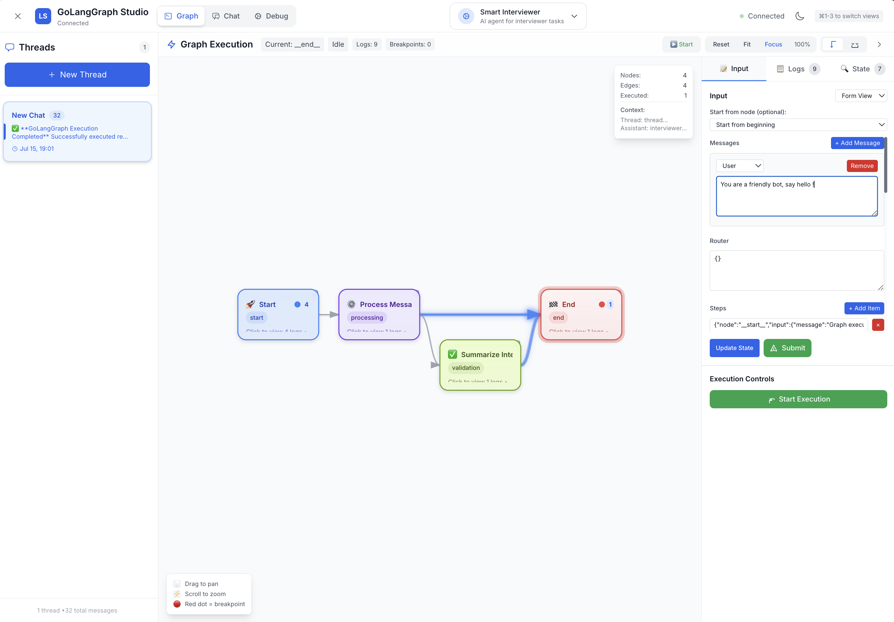
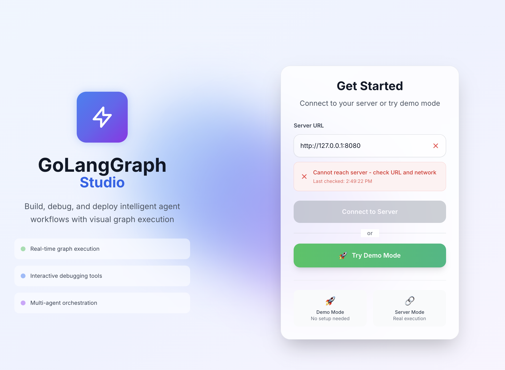

# GoLangGraph Studio Interface

<div align="center">
  
  <p><em>GoLangGraph Studio - A comprehensive development environment for GoLangGraph applications</em></p>
</div>

A fully functional React interface for debugging and testing GoLangGraph agents, adapted from the LangGraph Studio interface. This provides a comprehensive development environment for GoLangGraph applications without any limits for production use.

   

## 🚀 Features

This interface provides all the key features needed for GoLangGraph development:

### 🔗 Graph View

<div align="center">
  
  <p><em>Interactive graph visualization with real-time execution tracking</em></p>
</div>

- **Visual Graph Representation**: Interactive flow diagram showing your GoLangGraph execution
- **Real-time Node Status**: See which nodes are running, completed, or errored
- **Execution Path Tracking**: Visual representation of the current execution path
- **Graph Controls**: Run, step through, or stop graph execution
- **Interactive Nodes**: Click and inspect individual nodes
- **Agent Type Support**: Visualizes Chat, ReAct, and Tool agent types

### 💬 Chat Mode
- **Clean Chat Interface**: Similar to the official LangGraph Studio chat mode
- **Message History**: Persistent conversation threads
- **Markdown Support**: Rich text rendering for assistant responses
- **Typing Indicators**: Real-time feedback during message processing
- **Thread Management**: Create, switch between, and manage multiple chat threads
- **Agent Selection**: Easy switching between different GoLangGraph agents

### 🐛 Debug View
- **State Inspection**: View current graph state and variables
- **Step-by-Step Execution**: Detailed breakdown of each execution step
- **Execution Logs**: Real-time logs with different severity levels
- **Variable Tracking**: Monitor how variables change throughout execution
- **Performance Metrics**: Execution timing and duration tracking
- **WebSocket Streaming**: Real-time updates during execution

### 🎛️ Additional Features
- **Agent Management**: Create and manage multiple GoLangGraph agents
- **Thread Management**: Organize conversations and execution sessions
- **Connection Setup**: Easy configuration for GoLangGraph server connections
- **Responsive Design**: Works on desktop and mobile devices
- **Real-time Updates**: Live updates during graph execution via WebSocket

## 🛠️ Installation

### Prerequisites
- Node.js 16+ 
- npm or yarn
- A running GoLangGraph server (for actual functionality)

### Setup

1. **Clone the repository**
   ```bash
   git clone <repository-url>
   cd golanggraph-studio-interface
   ```

2. **Install dependencies**
   ```bash
   npm install
   # or
   yarn install
   ```

3. **Start the development server**
   ```bash
   npm start
   # or
   yarn start
   ```

4. **Open your browser**
   Navigate to `http://localhost:3000`

## 🔧 Configuration

### Connecting to GoLangGraph Server

When you first open the application, you'll see a connection setup screen:

<div align="center">
  
  <p><em>Initial connection setup interface</em></p>
</div>

1. **Server URL**: Enter your GoLangGraph server URL (default: `http://localhost:8080`)
2. **Agent ID**: (Optional) Specify a default agent ID
3. **API Key**: (Optional) Your API key for authenticated requests

### Environment Variables

You can also configure the application using environment variables:

```bash
# .env file
REACT_APP_GOLANGGRAPH_API_URL=http://localhost:8080
REACT_APP_AGENT_ID=agent
REACT_APP_API_KEY=your_api_key_here
```

## 🚀 Usage

### Starting Your GoLangGraph Server

Before using this interface, make sure you have a GoLangGraph server running. You can use the built-in auto-server:

```bash
# Navigate to your GoLangGraph project
cd your-golanggraph-project

# Start the auto-server (example)
go run cmd/golanggraph/main.go serve --config config.yaml
```

This will start the GoLangGraph server at `http://localhost:8080` by default.

### Using the Interface

1. **Connection Setup**: Configure your GoLangGraph server connection
2. **Choose Your View**: 
   - **Graph View**: Visualize and control graph execution
   - **Chat Mode**: Interactive chat with your agent
   - **Debug View**: Inspect execution details and logs
3. **Create Agents**: Set up different agent configurations
4. **Manage Threads**: Organize your conversations and sessions

## 🏗️ Architecture

### Project Structure

```
src/
├── components/
│   ├── layout/           # Layout components (Header, Sidebar, etc.)
│   ├── setup/           # Connection setup components
│   └── views/           # Main view components (Graph, Chat, Debug)
├── store/               # Zustand state management
├── types/               # TypeScript type definitions
├── index.css           # Global styles and Tailwind imports
└── App.tsx             # Main application component
```

### Key Technologies

- **React 18**: Modern React with hooks and concurrent features
- **TypeScript**: Type-safe development
- **Zustand**: Lightweight state management
- **Tailwind CSS**: Utility-first CSS framework
- **React Flow**: Interactive graph visualization
- **React Markdown**: Markdown rendering for chat messages
- **Heroicons**: Beautiful SVG icons
- **Date-fns**: Date formatting utilities
- **WebSocket**: Real-time communication with GoLangGraph

## 🔌 API Integration

The interface is designed to work with the GoLangGraph Server API:

### Endpoints Used
- `GET /api/v1/health` - Server health check
- `GET /api/v1/agents` - List available agents
- `GET /api/v1/agents/{id}` - Get agent details
- `GET /api/v1/graphs/{id}/topology` - Get graph topology
- `POST /api/v1/agents/{id}/execute` - Execute agent
- `WebSocket /api/v1/ws/agents/{id}/stream` - Stream execution events

### Authentication

For production deployments, the interface supports:
- **API Key**: For authenticated requests
- **Custom Authentication**: Configurable auth headers

### GoLangGraph Agent Types

The interface supports all GoLangGraph agent types:

- **Chat Agent**: Simple conversational flow
- **ReAct Agent**: Reasoning and Acting pattern with observe loops
- **Tool Agent**: Planning, execution, and review cycle

## 🎨 Customization

### Styling

The interface uses Tailwind CSS for styling. You can customize the appearance by:

1. **Modifying the Tailwind config** (`tailwind.config.js`)
2. **Updating CSS variables** in `src/index.css`
3. **Creating custom components** with your own styling

### Adding Features

The modular architecture makes it easy to add new features:

1. **Create new components** in the appropriate directory
2. **Add new state** to the Zustand store
3. **Update types** in `src/types/index.ts`
4. **Add new views** by creating components in `src/components/views/`

## 🔄 Migration from LangGraph

If you're migrating from the original LangGraph Studio interface:

### Key Differences

1. **API Endpoints**: GoLangGraph uses `/api/v1/` prefix and different endpoint structure
2. **Agent vs Assistant**: GoLangGraph uses "agents" instead of "assistants"
3. **WebSocket Streaming**: Uses WebSocket instead of Server-Sent Events
4. **Graph Structure**: Different node and edge metadata format
5. **Execution Model**: Direct agent execution instead of runs/threads

### Data Migration

The interface maintains backward compatibility for:
- Message history format
- Thread structure
- Basic configuration

## 🤝 Contributing

Contributions are welcome! Please feel free to submit a Pull Request.

### Development Guidelines

1. **Follow TypeScript best practices**
2. **Use Tailwind CSS for styling**
3. **Write meaningful commit messages**
4. **Add types for new features**
5. **Test your changes thoroughly**

## 📝 License

This project is licensed under the MIT License - see the [LICENSE](LICENSE) file for details.

## 🙏 Acknowledgments

- **GoLangGraph Team**: For creating the excellent GoLangGraph framework
- **LangChain Team**: For inspiration from the original LangGraph Studio
- **React Flow**: For the excellent graph visualization library
- **Tailwind CSS**: For the utility-first CSS framework
- **Heroicons**: For the beautiful icon set

## 📚 Related Links

- [GoLangGraph Documentation](https://github.com/piotrlaczkowski/GoLangGraph)
- [GoLangGraph GitHub Repository](https://github.com/piotrlaczkowski/GoLangGraph)
- [Original LangGraph Studio](https://langchain-ai.github.io/langgraph/cloud/how-tos/studio/quick_start/)
- [React Flow Documentation](https://reactflow.dev/)

---

**Note**: This is an independent React interface specifically adapted for GoLangGraph. For the official LangGraph Studio, please visit [studio.langchain.com](https://studio.langchain.com/). 