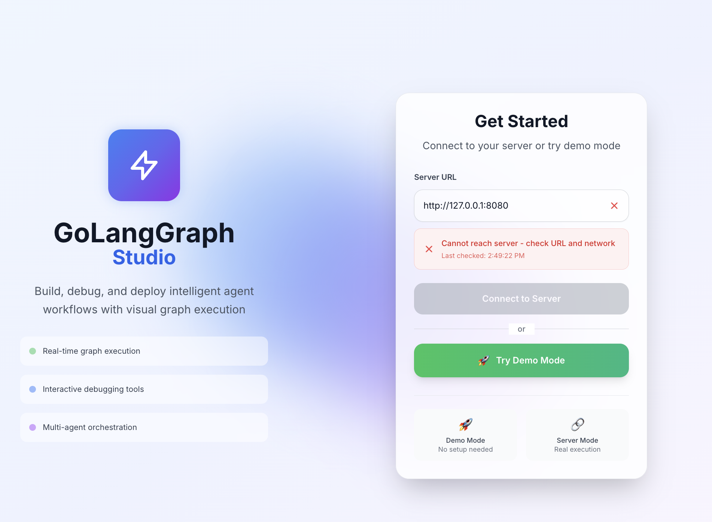

# Quick Start Guide

Get up and running with GoLangGraph Studio in just a few minutes!

## Prerequisites

Before you begin, ensure you have the following installed:

- **Node.js 16 or higher** - [Download here](https://nodejs.org/)
- **npm or yarn** - Comes with Node.js
- **A running GoLangGraph server** - See [GoLangGraph Documentation](https://github.com/piotrlaczkowski/GoLangGraph)

## Installation

### Step 1: Clone the Repository

```bash
git clone https://github.com/piotrlaczkowski/GoLangGraph-Project.git
cd GoLangGraph-Project/GoLangGraphStudio
```

### Step 2: Install Dependencies

=== "npm"

    ```bash
    npm install
    ```

=== "yarn"

    ```bash
    yarn install
    ```

### Step 3: Start the Development Server

=== "npm"

    ```bash
    npm start
    ```

=== "yarn"

    ```bash
    yarn start
    ```

The application will start and automatically open in your browser at `http://localhost:3000`.

## Initial Setup

### 1. Connection Configuration

When you first open GoLangGraph Studio, you'll see the connection setup screen:



Configure the following:

- **Server URL**: Enter your GoLangGraph server URL (default: `http://localhost:8080`)
- **Agent ID**: (Optional) Specify a default agent ID
- **API Key**: (Optional) Your API key for authenticated requests

### 2. Test the Connection

Click the "Test Connection" button to verify that GoLangGraph Studio can connect to your server.

### 3. Start Using the Interface

Once connected, you can:

- **Create agents** and configure their settings
- **Start chat conversations** with your agents
- **Visualize graph execution** in real-time
- **Debug and inspect** agent behavior

## Basic Usage

### Chat Mode

1. Select or create a new thread
2. Choose your agent
3. Start typing your message
4. Watch the agent respond in real-time

### Graph View

1. Switch to the Graph view
2. See your agent's execution flow
3. Click on nodes to inspect their state
4. Use execution controls to step through the process

### Debug Mode

1. Switch to Debug view
2. Monitor execution logs
3. Inspect state changes
4. Track performance metrics

## Next Steps

- Explore [Features](../features/graph-view.md) to learn about all capabilities
- Read the [User Guide](../guide/basic-usage.md) for detailed usage instructions
- Check out [Examples](../examples/basic-setup.md) for common use cases

## Troubleshooting

### Common Issues

**Connection Failed**
: Make sure your GoLangGraph server is running and accessible at the specified URL.

**Agent Not Responding**
: Check the Debug view for error logs and ensure your agent configuration is correct.

**UI Not Loading**
: Clear your browser cache and refresh the page.

For more troubleshooting tips, see the [Troubleshooting Guide](../guide/troubleshooting.md). 